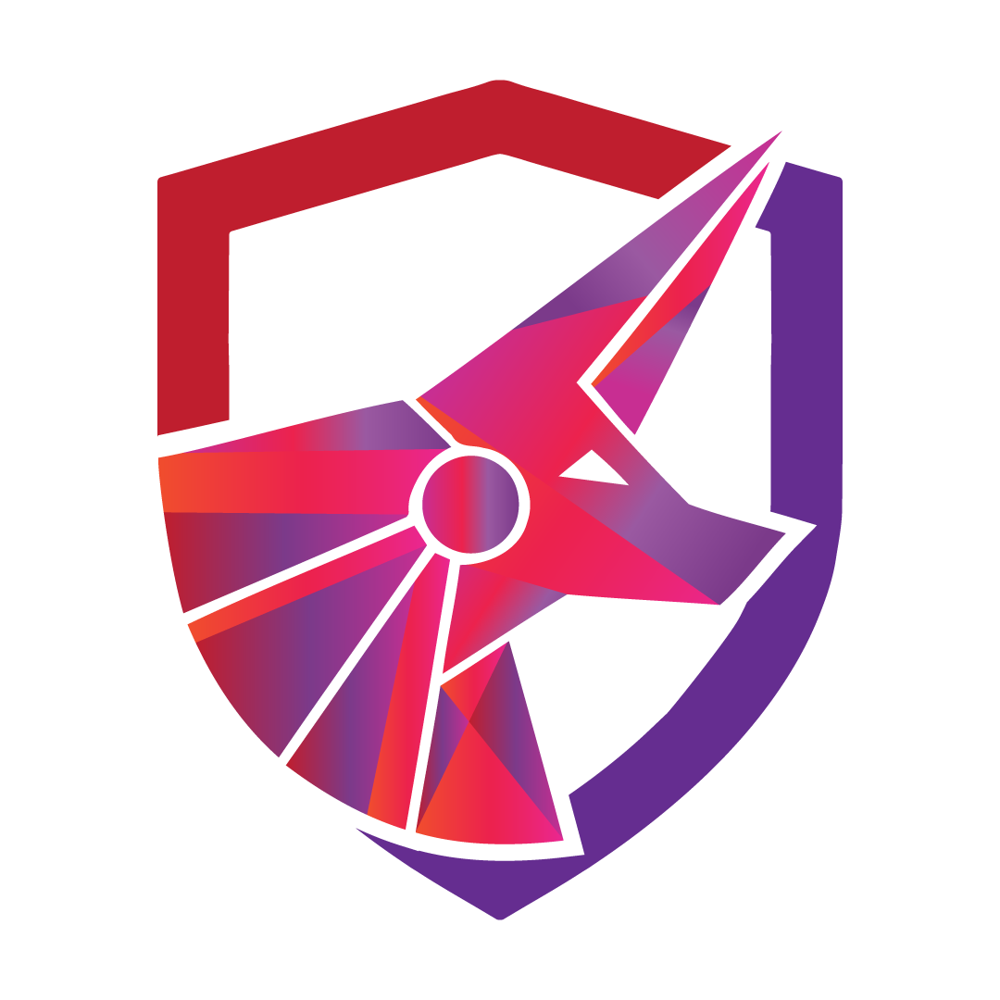

# TCM Capstone

## 1. Understanding the Objectives  
- Carefully went through the website to understand the scope and goals.
- Identify the key deliverables, such as flags, reports, or specific objectives.
- Determine the rules and constraints of the challenge (e.g., time limits, tools allowed).
- Break down the objectives into smaller, actionable tasks to create a clear plan.

## 2. Set Up Your Environment  
- Ensure your tools (e.g., Kali Linux, Burp Suite, etc.) are installed and updated.
- Verify network configurations and connectivity.

## 3. Information Gathering  
- Perform reconnaissance using tools like `nmap` for port scanning.

- Documenting potential vulnerabilities
### Reflected XXS 


### Stored XSS


### Application allows weak password
When I signed up for a user - it alowed me to sign up with 'test' as the username and the password, and hence may be susceptible to brute force attacks.

### SQL injection


## 4. Enumeration  
- Use tools like `Gobuster` or `Dirb` to find hidden directories. But I used ffuf

- Enumerate services (e.g., SMB, FTP) for additional information.

## 5. Exploitation  
- Used SQL injection to obtain the user's passwords.

- Cracked the passwords using 'hashcat'.
In cracking the hashes we need to identify which mode need to be used. We can easily identify the modes in this website - https://hashcat.net/wiki/doku.php?id=example_hashes

Then we used mode in hashcat as follows
```
hashcat -m 3200 hash /usr/share/wordlists/wifite.txt
```
- I also ran `sqlmap` to have a complete understanding of the database
```
sqlmap -r sql.txt -T users --dump

```


## 6. Privilege Escalation  
- Since we have all the password hashes for the users/admins we can login as admins and navigate to the admin panel.


## 7. Post-Exploitation  
- From here we can use Insecure file upload to gain remote code execution using burpsuite.


## 9. Cleanup  
- There are no cleanup necessary as this run in docker container in my own system. http://localhost.capstone/init.php will reset the database.

## 10. Review and Reflect  
- Just because I found one vulnerability does not meet there will not be multiple.
- Think like an ethical hacker and not be lazy.

Thanks